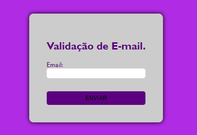
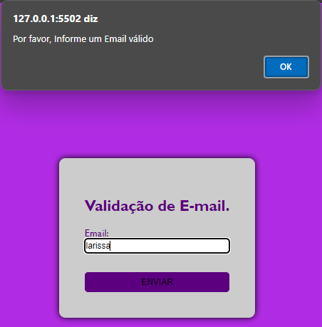
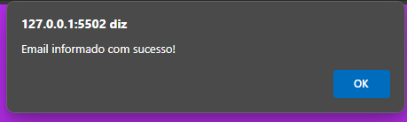
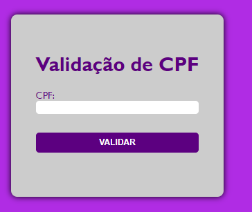
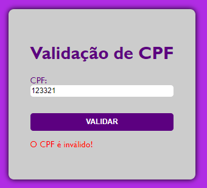
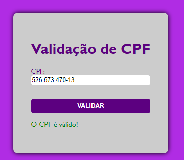
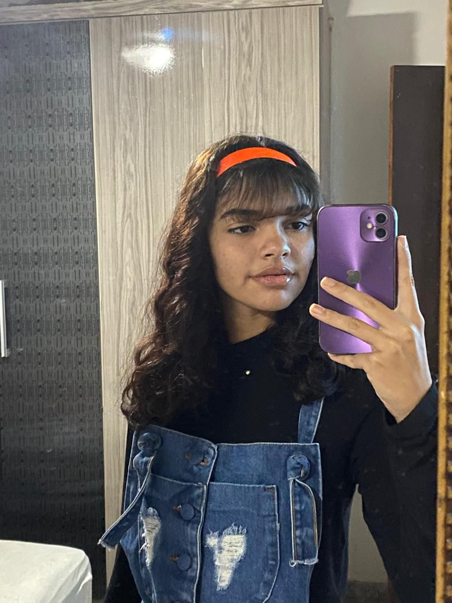

# VALIDAÇÕES DO E-MAIL E CPF🪪

## Começando 🚀
Nesse projeto, foi criado 2 páginas de validações (1 especificamente para a validação de E-mail e a segunda para a validação do CPF) na matéria de:
* Programação Web I.

## Sobre o projeto 📋 
Esse projeto é composto por 2 páginas, uma contendo a validação de E-mail e a outra para a validação do CPF. Neste README inclui o uso de fotos pois assim fica de uma forma mais fácil de ser entendido, não sendo uma leitura muito complexa e o site tornando-se bem fácil de ser utilizado.
### Validação de E-mail:

Assim que se abre o site, você verá a imagem acima, nesse campo voce irá colocar o seu E-mail. LEMBRANDO: Sempre coloque seu E-mail por completo, senão irá aparecer a seguinte notificação:

 

Quando você completar seu E-mail da forma certa sua validação estará pronta! Exemplo: larissa@gmail.com (E-mail fictício)

### Validação de CPF: 

A tela de início da validação do CPF é praticamente igual a tela inicial da validação de E-mail. Uma tela bem fácil de se entender. Conforme descrito, você irá colocar o seu CPF no campo que há na tela inicial.

Caso falte números no CPF, a mensagem em vermelho aparecerá. Porém quando você escrever de forma certa aparecerá assim:

DUAS OBSERVAÇÕES IMPORTANTES: Esse CPF do print é falso, usei um gerador de CPF's no Google. Se você colocar seu CPF sem pontuação/traço irá dar certo da mesma forma!

## Técnicas e Tecnologias utilizadas 🔨
* Visual Studio Code 
* Git Bash
* Git Hub
* HTML5
* CSS3
* JavaScript
* Live Server (A extensão Live Server permite criar um servidor local através do VSCode. Com ele é cortado a necessidade de sempre que fizer uma alteração no código atualizar o navegador.)

## Autores ✍🏻
| [ Larissa Gabrielle Fagundes Andrade.](https://github.com/gabriellefagundes) |
| :---: 
## Meu LinkedIn:
|  [ LinkedIn.](https://www.linkedin.com/in/larissa-gabrielle-a74a272b3/)
| :---: 
